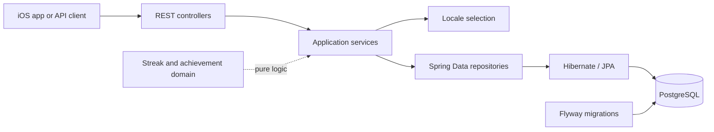

# Anchor Backend — Portfolio Edition

Anchor is a commercial iOS application centered on brief daily reflections. This
repository is a deliberately reduced, independently runnable portfolio edition of
the privately maintained backend. It demonstrates representative engineering
patterns without publishing production infrastructure, administration tooling,
credentials, customer data, unreleased content, or subscription integrations.

This is **not** the production repository. The included reflection text and database
records are fictional examples created for local evaluation.

## What this edition demonstrates

- Java 21 and Spring Boot with controller/service/repository separation
- PostgreSQL persistence through Spring Data JPA
- versioned schema and fictional fixtures with Flyway
- localized content selection from `Accept-Language`, with English fallback
- deterministic UTC daily-reflection selection and bounded random selection
- pure, testable streak and achievement domain logic
- Jakarta Bean Validation and centralized JSON error handling
- unit tests plus database-backed HTTP integration tests
- multi-stage container image and Docker Compose development database

Production write APIs, AI-assisted editorial tools, edge-provider authentication,
Apple subscription verification, analytics, and deployment manifests are omitted.
The public API is consequently read-only and intentionally requires no credentials.

## Architecture



Public routes are versioned under `/api/v1`:

| Method | Route                                  | Purpose                               |
| ------ | -------------------------------------- | ------------------------------------- |
| `GET`  | `/api/v1/health`                       | Lightweight service health            |
| `GET`  | `/api/v1/collections`                  | Active localized collection summaries |
| `GET`  | `/api/v1/collections/{id}`             | Collection and active reflections     |
| `GET`  | `/api/v1/collections/{id}/reflections` | Reflections in one collection         |
| `GET`  | `/api/v1/reflections/today`            | Stable UTC daily reflection           |
| `GET`  | `/api/v1/reflections/random?limit=3`   | One to twenty free reflections        |

## Run locally

Requirements: Java 21 and Docker with Compose. Maven is provided through the wrapper.

```bash
cp .env.example .env
docker compose --env-file .env up -d postgres
set -a; source .env; set +a
./mvnw spring-boot:run
```

The API listens on `http://localhost:8080`. Stop the database with
`docker compose down`; add `--volumes` only when you intentionally want to discard
the local database.

Build and test:

```bash
./mvnw clean verify
```

Tests use an in-memory H2 database in PostgreSQL compatibility mode and execute the
same Flyway migrations used locally.

## Example requests

```bash
curl -s http://localhost:8080/api/v1/reflections/today
curl -s -H 'Accept-Language: en' http://localhost:8080/api/v1/collections/focus
curl -s 'http://localhost:8080/api/v1/reflections/random?limit=2'
```

Example response (IDs depend only on the fictional seed data):

```json
{
  "id": 1,
  "text": "Choose one useful task and give it your full attention.",
  "collectionId": "focus",
  "premium": false
}
```

A missing collection returns the centralized error shape:

```json
{
  "timestamp": "2026-01-01T12:00:00Z",
  "status": 404,
  "error": "Not Found",
  "message": "Collection 'missing' was not found.",
  "fieldErrors": {}
}
```

## Configuration

All runtime values are supplied through environment variables documented in
`.env.example`. Its values are intentionally local and non-secret. Never commit a
real `.env`, certificate, key, database dump, or production hostname.

## Copyright

Copyright © 2026 Ahmed Drira. All rights reserved.  
This repository is published for portfolio and evaluation purposes.  
No permission is granted to use, copy, modify, distribute, or deploy  
this software except where GitHub’s Terms of Service require otherwise.

No open-source license is granted or implied.
